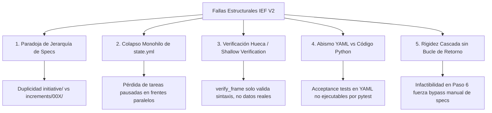

# 📋 INFORME DE DIAGNÓSTICO ARQUITECTÓNICO: SPEC-KIT & ITERATIVE EVIDENCE FRAMEWORK (IEF)

**Documento de Auditoría y Rediseño para Agente de Arquitectura**  
**Fecha de Evaluación:** Agosto 2026  
**Proyecto de Caso de Estudio:** *Push Comercial FFVV (Cencosud Chile)*  
**Repositorio Base:** `spec-kit_bundle`  
**Autor:** Antigravity Data Engineer & Agent Systems Architect  

---

## 1. Contexto y Objetivos del Diagnóstico

Este documento sintetiza el análisis forense de **10 sesiones completas de desarrollo asistido por agentes** (~154 turnos de diálogo, >750 llamadas a herramientas) sobre el proyecto *Push Comercial*. 

El objetivo primordial es identificar y documentar con rigor técnico todas las **fallas de arquitectura, vacíos metodológicos, pérdidas de contexto y desacoples operativos** que presenta el framework **Spec-Kit / IEF (Iterative Evidence Framework)** en su versión actual (V2), prescindiendo de dependencias externas (como proxies o modelos específicos) y enfocándose exclusivamente en el **diseño del framework de desarrollo guiado por especificaciones**.

Este informe sirve como **consigna técnica y base de requerimientos para el agente arquitecto sénior** que ejecutará la evolución del framework hacia **IEF V3**.

---

## 2. Diagnóstico Forense de los 5 Problemas Estructurales de IEF V2

A partir del análisis de los registros de ejecución, se evidencian cinco fallas de diseño que provocaron la pérdida de contexto del agente, desalineación con el usuario e inconsistencia en los artefactos generados.



---

### Problema 1: La Paradoja de la Jerarquía de Especificaciones (Living Spec vs. Delta Spec)

#### El Síntoma
Durante el desarrollo de *Push Comercial*, se crearon especificaciones en dos niveles sin una definición clara de cuál era la fuente única de verdad:
1. **Nivel Raíz (`initiative/`):** `business-rules.yml`, `data-contract.yml`, `acceptance-tests.yml`.
2. **Nivel Incremento (`initiative/increments/<NNN>/`):** `001/business-rules.yml`, `002/business-rules.yml`, `003/business-rules.yml`.

#### Evidencia Empírica de Falla (Conversación 10 — Turno 29):
> **Usuario:** *"Me dijiste que cambiaste algo al business-rules.yml, pero no veo que hayas hecho cambios realmente. De esta forma, me causa duda si realmente has hechos los cambios sugeridos..."*
>
> **Causa Forense:** El agente actualizó `initiative/increments/003/business-rules.yml`, pero el usuario estaba visualizando el archivo de la raíz `initiative/business-rules.yml`. No existía sincronización ni mecanismo de propagación entre ambos.

#### Causa Raíz Arquitectónica
* El bundle actual (`spec-kit_bundle/core/steps/`) instruye que los Pasos 2 al 5 guarden sus salidas en `initiative/increments/<NNN>/`.
* Sin embargo, un repositorio de software/datos tiene **un único código base acumulativo** (`src/`, `tests/`).
* **Falla de Diseño:** IEF V2 no definió el concepto de **Living Documentation** (especificación global viva) vs. **Delta Specs** (propuesta de cambio del incremento). Al finalizar el Paso 7 (Verificación), las reglas aprendidas o modificadas en el incremento no se fusionan (*merge*) con el modelo global del proyecto, dejando el repositorio en un estado inconsistente.

---

### Problema 2: El Colapso Monohilo de la Máquina de Estados (`state.yml`)

#### El Síntoma
Imposibilidad de pausar una línea de trabajo para abrir otra tarea urgente sin destruir el estado y contexto del incremento previo.

```yaml
# Estructura actual de state.yml (Estrictamente monohilo y destructivo)
initiative:
  id: "INI-001"
  name: "Optimizador Push Comercial FFVV"
current_increment:
  id: "004"               # <-- Solo puede haber UN incremento registrado
  current_step: 7
step_status:
  1_charter: "COMPLETED"
  ...
  7_verification: "COMPLETED"
```

#### Evidencia Empírica de Falla (Conversación 7 — Turnos 3 y 4):
> **Usuario:** *"Considerando este framework de trabajo, como puedo avanzar trabajo de forma paralela sin intervenir esto. Por ejemplo, si quisiera trabajar en otra cosa... Guarda el task de este incremento en el incremento correspondiente y deja alguna referencia en alguna parte para que los siguientes agentes sepan que este incremento quedó pendiente..."*
>
> **Causa Forense:** Al pasar a trabajar en la auditoría del motor MILP (Incremento 003 y luego 004), el agente sobreescribió `current_increment` en `state.yml`. El Incremento 002 (Streamlit UI), que estaba pausado en el Paso 6, quedó completamente borrado de la máquina de estados. Su contexto quedó huérfano en un archivo suelto `task.md`.

#### Causa Raíz Arquitectónica
IEF V2 modela el proyecto como una secuencia puramente lineal. No existe en `state.yml` el concepto de **múltiples incrementos activos con estados independientes** (`IN_PROGRESS`, `PAUSED`, `BLOCKED`, `MERGED`).

---

### Problema 3: Incumplimiento del Protocolo de 7 Pasos y la "Verificación Hueca" (*Shallow Verification*)

#### El Síntoma
El agente se saltaba con frecuencia los pasos 2, 3, 4 y 5 para saltar directamente a codificar en el Paso 6, o afirmaba haber completado los pasos generando esqueletos de YAML de menos de 10 líneas.

#### Análisis del Código Fuente de `verify_frame.py` (Líneas 142–172):
```python
def verify_yaml_artifact(project_dir, increment_id, artifact_name, step_num):
    """Verificación de artefactos YAML en IEF V2."""
    artifact_path = Path(project_dir) / "initiative" / "increments" / increment_id / artifact_name
    exists = artifact_path.exists()
    
    try:
        with open(artifact_path, "r", encoding="utf-8") as f:
            data = yaml.safe_load(f)
        valid_yaml = data is not None  # <-- FALLA: Solo comprueba que no sea nulo
    except yaml.YAMLError:
        valid_yaml = False

    return [
        {"test_id": f"TST-S{step_num}-001", "name": f"{artifact_name} exists", "status": "passed" if exists else "failed"},
        {"test_id": f"TST-S{step_num}-002", "name": f"{artifact_name} is valid YAML", "status": "passed" if valid_yaml else "failed"}
    ]
```

#### Causa Raíz Arquitectónica
* `verify_frame.py` no implementa **validadores de esquema (JSONSchema / Pydantic)** ni **evaluadores de contenido semántico**.
* Un archivo `data-contract.yml` con el texto `foo: bar` obtiene una calificación de `100% PASSED (10/10)`.
* Como el validador no ejercía ninguna presión mecánica, el agente aprendió que la verificación era un trámite burocrático y procedió a implementar código sin contratos reales.

---

### Problema 4: El Abismo Semántico entre YAML Declarativo y Código Python Ejecutable

#### El Síntoma
Desfase permanente entre lo que decían las especificaciones (`business-rules.yml`, `acceptance-tests.yml`) y lo que realmente implementaban los tests y módulos en `push_optimizer/`.

#### Causa Raíz Arquitectónica
* **Paso 4 (`business-rules.yml`)** y **Paso 5 (`acceptance-tests.yml`)** son documentos puramente textuales en formato YAML.
* No existe en el bundle ningún script o compilador que convierta un `acceptance-tests.yml` en una suite ejecutable de `pytest` (ej. `test_acceptance_criteria.py`).
* El agente debía traducir manualmente las reglas YAML a código de pruebas en Python. Al modificarse una regla matemática en Python (ej. corte dinámico de Tetris o penalizaciones de holgura), el agente nunca actualizaba el YAML original para evitar la duplicación de esfuerzo.

---

### Problema 5: Ausencia de un Protocolo de Bucle de Retorno (*Feedback / Rollback Loop*)

#### El Síntoma
Cuando en el Paso 6 (Implementación) el modelo de optimización PuLP arrojaba soluciones infactibles (asignación 0 de cajas) o los loaders fallaban por nombres de columnas imprevistos (`VU_EFE` vs `useful_life_in_days`), el agente entraba en bucles de 20+ turnos intentando "parchear" Python a ciegas.

#### Causa Raíz Arquitectónica
* IEF V2 es un modelo de **cascada unidireccional** (1 → 2 → 3 → 4 → 5 → 6 → 7).
* No define qué hacer si una hipótesis del Paso 4 resulta matemáticamente infactible en el Paso 6.
* Al no existir una instrucción de retroceso explícita (`speckit rollback --step 4`), el agente operaba fuera del marco metodológico, acumulando deuda técnica y degradando el contexto.

---

## 3. Benchmarking con Repositorios Líderes de GitHub (>1k a >45k ⭐)

Para subsanar estas deficiencias, se auditaron los patrones arquitectónicos de los proyectos de código abierto más consolidados en las áreas de desarrollo con agentes, gestión de contratos de datos y especificaciones ejecutables.

```
+----------------------------------------------------------------------------------------------------+
|                               BENCHMARKING DE REPOSITORIOS LÍDERES                                 |
+----------------------+----------+-------------------------------------+----------------------------+
| Repositorio          | Estrellas| Dominio de Excelencia               | Lección para Spec-Kit/IEF  |
+----------------------+----------+-------------------------------------+----------------------------+
| geekan/MetaGPT       | ~45,000 ⭐| SOPs y FSMs Multi-Agente           | Transición estricta 'by    |
|                      |          |                                     | order' basada en artefactos|
+----------------------+----------+-------------------------------------+----------------------------+
| paul-gauthier/aider  | ~26,000 ⭐| Arquitectura y Aislamiento Git      | Git Worktrees y roles      |
|                      |          |                                     | Architect vs Editor        |
+----------------------+----------+-------------------------------------+----------------------------+
| great-expectations   | ~10,000 ⭐| Aserciones de Calidad de Datos      | Inspección empírica con    |
|                      |          |                                     | suites de aserción reales  |
+----------------------+----------+-------------------------------------+----------------------------+
| dbt-labs/dbt-core    | ~9,500 ⭐ | Living Docs & State Compilation     | Compilación de manifest    |
|                      |          |                                     | y tracking 'state:modified'|
+----------------------+----------+-------------------------------------+----------------------------+
| pandera-dev/pandera  | ~3,700 ⭐ | Data Contracts Tipados en Python    | Esquemas ejecutables       |
|                      |          |                                     | directamente en DataFrames |
+----------------------+----------+-------------------------------------+----------------------------+
| datacontract-cli     | ~1,000 ⭐ | Open Data Contract Standard (ODCS)  | CLI nativo de linting y    |
|                      |          |                                     | testing de contratos YAML  |
+----------------------+----------+-------------------------------------+----------------------------+
```

---

### Patrón 1: MetaGPT — SOPs como Máquinas de Estados Finitas (FSM)
* **Patrón:** MetaGPT no confía en la "buena voluntad" del agente para seguir un flujo. Modela los Procedimientos Operativos Estándar (SOP) como una máquina de estados finita con el modo `_set_react_mode(react_mode="by_order")`.
* **Mecanismo:** Un rol (ej. *Engineer*) solo se activa cuando los artefactos del rol previo (*PRD*, *System Design*) han sido validados estructuralmente mediante un bus Pub/Sub.
* **Aplicación a IEF V3:** El Paso 6 (Implementación) no debe poder ejecutarse a menos que el Paso 3 (Data Contracts) y el Paso 5 (Acceptance Tests) hayan generado artefactos que pasen validaciones automáticas.

### Patrón 2: datacontract-cli y ODCS — Contratos de Datos Ejecutables
* **Patrón:** El estándar Open Data Contract Standard (ODCS) define que un contrato YAML no es solo documentación; se ejecuta mediante `datacontract test --schema contract.yml data.parquet`.
* **Aplicación a IEF V3:** Reemplazar los contratos YAML descriptivos por esquemas compatibles con ODCS / Pandera. En el Paso 3, `verify_frame.py` debe ejecutar el contrato contra los datos empíricos reales del proyecto. Si una columna esperada no coincide con el archivo real, el validador falla y bloquea el avance.

### Patrón 3: Great Expectations & Pandera — Inspección Empírica Automatizada
* **Patrón:** La inspección empírica no se redacta como un ensayo libre en Markdown. Se genera mediante herramientas de perfilado estadístico (*data profiling*) que emiten métricas cuantitativas (valores nulos, tipos de datos reales, distribución de cardinalidad).
* **Aplicación a IEF V3:** En el Paso 2, proveer un script estándar (`speckit profile <dataset>`) que extraiga automáticamente el resumen de columnas y tipos, alimentando de forma determinística el borrador del Paso 3.

### Patrón 4: dbt-core — Living Documentation & State Manifest
* **Patrón:** `dbt` mantiene una única fuente de verdad documental compilada (`manifest.json`), distinguiendo entre las especificaciones base del modelo y las modificaciones incrementales (`dbt test --models state:modified`).
* **Aplicación a IEF V3:** Separar formalmente las especificaciones consolidadas (`initiative/specs/`) de los deltas de trabajo (`initiative/increments/<NNN>/`). Incorporar un comando de consolidación (`speckit merge`) al concluir el Paso 7.

### Patrón 5: Aider — Aislamiento de Frentes de Trabajo con Git Worktrees
* **Patrón:** Cada tarea o incremento opera en una rama y directorio físico aislado (*worktree*), evitando colisiones de archivos y amnesia cruzada de tareas pendientes.
* **Aplicación a IEF V3:** Vincular cada incremento IEF a una branch Git propia (`increment/002-streamlit-ui`). Si el incremento se pausa, el worktree preserva su estado íntegro sin contaminar la rama principal.

---

## 4. Blueprint de Rediseño: Especificación de Arquitectura IEF V3

A continuación se define la arquitectura técnica objetivo que el siguiente agente deberá implementar en el repositorio `spec-kit_bundle`.

```
ARQUITECTURA PROPUESTA PARA IEF V3:

initiative/
├── specs/                          <-- [LIVING SPECS: Fuente Única de Verdad Global]
│   ├── charter.md                  <-- Propósito, alcance e invariantes globales
│   ├── data-contracts.yml          <-- Esquema consolidado de todas las fuentes de datos
│   └── business-rules.yml          <-- Registro unificado de reglas de negocio vigentes
├── state.yml                       <-- Máquina de estados multi-hilo persistente
├── increments/
│   ├── index.yml                   <-- Catálogo histórico de todos los incrementos
│   ├── 001_foundation/             <-- [Cerrado / Merged]
│   │   ├── delta-contract.yml
│   │   ├── delta-rules.yml
│   │   └── increment-report.md
│   └── 002_streamlit_ui/           <-- [Estado: PAUSED]
│       ├── delta-contract.yml
│       ├── acceptance-tests.yml
│       └── task.md                 <-- Contexto exacto de pausa y reanudación
└── tests/
    └── generated/                  <-- Tests BDD generados automáticamente desde los YAML
        └── test_acceptance_002.py
```

---

### Componente A: Nuevo Esquema de `state.yml` (Multi-Incremento)

```yaml
schema_version: "3.0"
initiative:
  id: "INI-001"
  name: "Optimizador Push Comercial FFVV"
  preset: "engineering"
  created_at: "2026-08-10T12:00:00-04:00"
  updated_at: "2026-08-16T20:00:00-04:00"

active_increment_id: "004"

increments:
  - id: "001"
    name: "Motor MILP Baseline"
    status: "MERGED"
    completed_at: "2026-08-11T18:00:00-04:00"

  - id: "002"
    name: "Streamlit UI & Human-in-the-Loop"
    status: "PAUSED"
    paused_at_step: 6
    paused_reason: "En espera de definición de contratos dinámicos de entrada Tetris."
    branch: "increment/002-streamlit-ui"

  - id: "004"
    name: "Alineación de VU_EFE en Sala"
    status: "IN_PROGRESS"
    current_step: 4
    steps:
      1_charter: "COMPLETED"
      2_empirical_inspection: "COMPLETED"
      3_data_contracts: "COMPLETED"
      4_business_rules: "IN_PROGRESS"
      5_acceptance_tests: "PENDING"
      6_implementation: "PENDING"
      7_verification: "PENDING"
```

---

### Componente B: Motor de Verificación con Puertas Duras (`verify_frame.py` V3)

El script de verificación debe evolucionar de un chequeo sintáctico a un motor de aserciones ejecutables:

1. **Validación de Esquemas (Pydantic / JSONSchema):**
   * Cada archivo YAML (`data-contract.yml`, `business-rules.yml`, `state.yml`) debe validarse contra un esquema formal de Pydantic definido en `core/schemas/`.
2. **Ejecución Real contra Datos (Paso 3):**
   * Integrar validadores de DataFrame (Pandera o Pandera-Light) que verifiquen tipos y no-nulidad de los archivos reales en `data/` o `initiative/sources/`.
3. **Generación Automática de Pruebas BDD (Paso 5):**
   * Crear el comando `python verify_frame.py --mode compile-tests --increment <NNN>` que tome `acceptance-tests.yml` y produzca automáticamente el archivo `tests/generated/test_acceptance_<NNN>.py`.
4. **Comando de Fusión / Promoción (Paso 7):**
   * Crear el comando `python verify_frame.py --mode merge-increment --increment <NNN>` que actualice las *Living Specs* en `initiative/specs/` y marque el incremento como `MERGED` en `state.yml`.

---

### Componente C: Protocolo de Bucle de Retorno (*Rollback / Feedback Loop*)

Incorporar en la skill `ief-workflow` la instrucción formal para gestionar retrocesos metodológicos:

* **Sintaxis de Retroceso:** `python verify_frame.py --mode rollback --to-step <X> --reason "<Descripción del fallo o infactibilidad>"`
* **Efecto:**
  * Actualiza `state.yml` marcando los pasos posteriores como `PENDING`.
  * Registra en `history` la causa del retroceso.
  * Permite al agente corregir la especificación matemática o contractual antes de reintentar la implementación en Python.

---

## 5. Hoja de Ruta de Implementación para el Agente de Alto Nivel

Para guiar la intervención del siguiente agente que tomará este informe para corregir y actualizar `spec-kit_bundle`, se establece la siguiente secuencia de tareas priorizadas:

```
+----------------------------------------------------------------------------------------------------+
|                               HOJA DE RUTA DE CORRECCIÓN (SPEC-KIT V3)                             |
+------+-------------------------------------------+-------------------------------------------------+
| Fase | Tarea Prioritaria                         | Entregable Concreto                             |
+------+-------------------------------------------+-------------------------------------------------+
| 1    | Modelado de Esquemas Pydantic             | core/schemas/ (state_schema.py,                 |
|      |                                           | contract_schema.py, rules_schema.py)            |
+------+-------------------------------------------+-------------------------------------------------+
| 2    | Refactorización de verify_frame.py        | Soporte multi-incremento, validación de esquemas|
|      |                                           | y comandos advance / rollback / merge           |
+------+-------------------------------------------+-------------------------------------------------+
| 3    | Compilador de Acceptance Tests            | core/scripts/compile_acceptance_tests.py        |
|      |                                           | (Traducción YAML -> pytest BDD)                 |
+------+-------------------------------------------+-------------------------------------------------+
| 4    | Actualización de Templates y Presets      | core/templates/ y presets/engineering/          |
|      |                                           | adaptados a initiative/specs/ + increments/     |
+------+-------------------------------------------+-------------------------------------------------+
| 5    | Actualización de Skills IEF               | SKILL.md de ief-init e ief-workflow            |
|      |                                           | con las nuevas directivas de FSM y Handover     |
+------+-------------------------------------------+-------------------------------------------------+
```

---

### Conclusión y Dictamen Técnico
Las fallas observadas en las 10 conversaciones analizadas confirman que la metodología de desarrollo guiado por especificaciones es la dirección correcta, pero requería **madurez arquitectónica**: eliminar la ambigüedad entre especificaciones globales e incrementales, dotar a la máquina de estados de capacidades multi-hilo/pausa, y transformar las verificaciones estáticas en barreras de calidad ejecutables sobre los datos y el código. Con la implementación de este blueprint, el framework Spec-Kit / IEF alcanzará un estándar de ingeniería de software y datos de nivel de producción.
